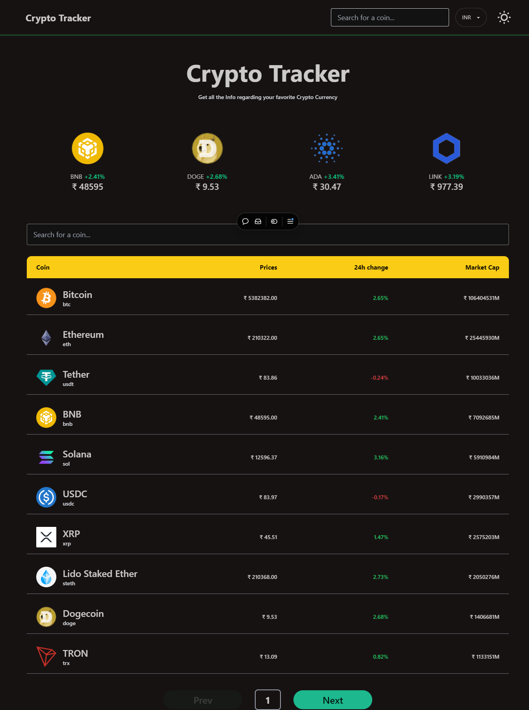
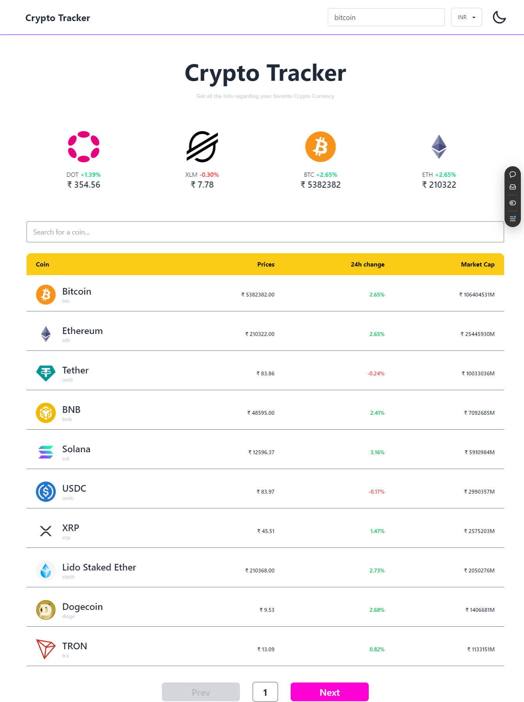
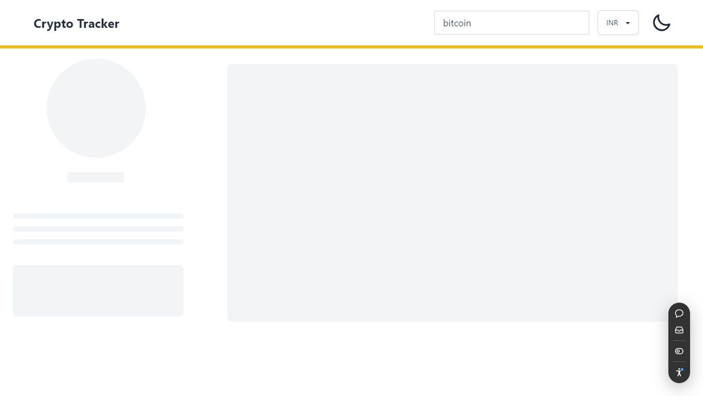
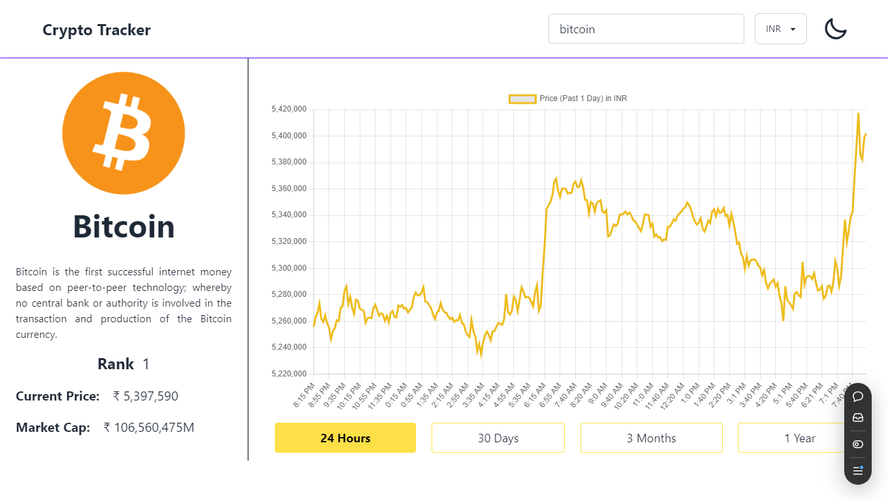
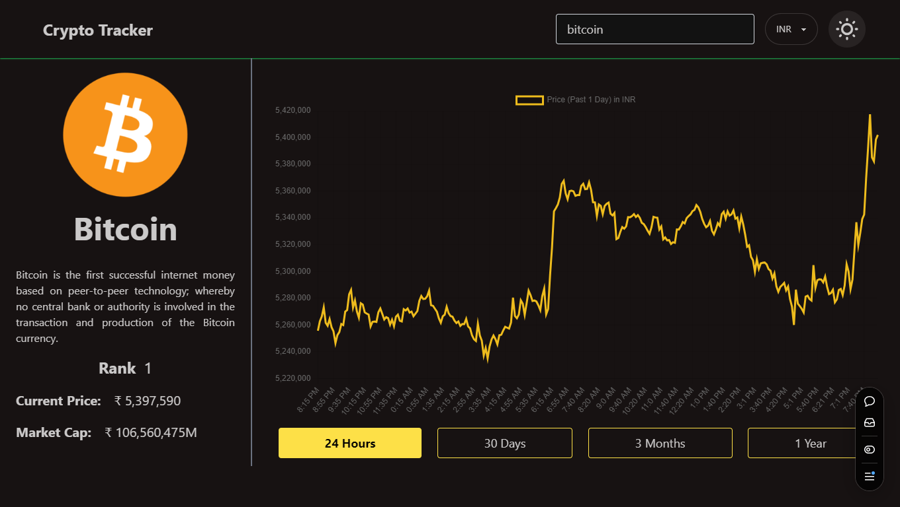

# Crypto Tracker Web App

A crypto currency tracking web application that fetches data using the CoinGecko API. The app provides users with the ability to search, track, and view detailed information about various crypto currencies.

## Features

- **Live Cryptocurrency Data:** Fetches real-time cryptocurrency data from the CoinGecko API.
- **Search Functionality:** Users can search for specific cryptocurrencies and get instant suggestions.
- **Pagination:** Displays coins with pagination for seamless navigation.
- **Detailed Coin Information:** Provides details on individual coins, including price, market cap, historic data graph and other metrics.
- **Trending Coins:** Carousel display of trending cryptocurrencies using AliceCarousel.
- **Loading Skeleton:** Displays a smooth loading animation while fetching data using ContentLoader.
- **Conditional Theme Support:** Supports light and dark themes with dynamic styling.
- **Responsive Design:** Fully responsive UI built with Tailwind CSS, ensuring compatibility across various devices.

## Tech Stack

- **Frontend Library:** React
- **State Management:** Zustand
- **Routing:** React Router
- **API:** CoinGecko API for cryptocurrency data
- **Libraries:** 
  - `react-alice-carousel` for trending coin carousel
  - `chart.js` for data visualization
  - `react-content-loader` for loading skeletons
  - `axios` for API requests
- **Styling:** Tailwind CSS with Daisy UI components
- **Error Handling:** React Error Boundary for managing errors gracefully

## Website Link

<a href="https://coingecko-crypto-tracker-react.vercel.app/" target="_blank">Crypto Tracker</a>

## Project Screenshot

